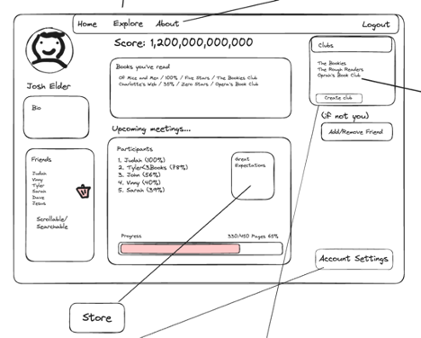
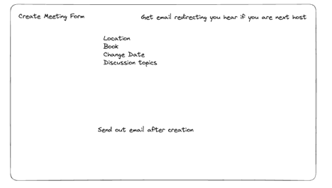
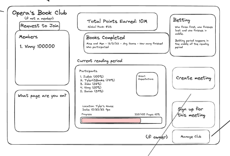
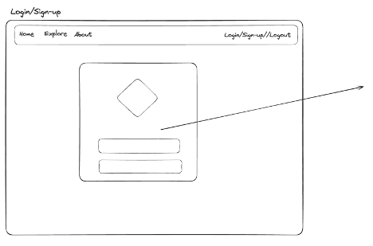

# Booky

## Team

John Gray
Vinny Vitiritto
Judah Viggers
Tyler Primavera

## Install Extensions

-   Prettier: <https://marketplace.visualstudio.com/items?itemName=esbenp.prettier-vscode>
-   Black Formatter: <https://marketplace.visualstudio.com/items?itemName=ms-python.black-formatter>

## Other Requirements

-   Docker

## Deliverables

-   Wire-frame diagrams
    







-   [API documentation] (README_APIDOCS.md)
-   Project is deployed to PostgreSQL (BE, DB) & GitLab-pages (FE)

## Intended Market

This web application targets book enthusiasts that want to organize and gamify their book club meeting experience.

## Functionality

-   Visitors to the site need to sign up for an account in order to access book meeting scheduling, clubs, and betting functions
-   Users can create a book club and create a meeting for the club that they own
-   Users can join different clubs
-   Users can add other users as friends
-   Users can update their book progress and see the reading progress of other book meeting attendees
-   Users may place bets on who is expected to finish the book first
-   Users that are successful in their bets receive an award of points
-   Users can search for books to create a meeting using a GoogleBooks API

### Project Initialization

1. clone repository onto local machine
2. navigate to project directory created from cloning repository
3. Run `docker compose build`
4. Run `docker compose up`

### Other files

-   `docker-compose.yaml`: UI and FastAPI service.
-   `.gitlab-ci.yml`: The "ci/cd" file where automated unit tests, code quality checks, and
    the building and deployment of your production system will be configured.

-   `.gitignore`: This is a file that prevents unwanted files
    from getting added to your repository, files like
    `pyc` files, `__pycache__`, etc.
-   `.env.sample`: This file is a template to copy when
    creating environment variables for your team. Create a
    copy called `.env` and put your own passwords in here
    without fear of it being committed to git (see `.env`
    listed in `.gitignore`).

### Installing python dependencies locally

Create a virtual environment and pip install the requirements.

From inside the `api` folder:

```bash
python -m venv .venv
```

Then activate the virtual environment

```bash
source .venv/bin/activate
```

And finally install the dependencies

```bash
pip install -r requirements.txt
```

Then make sure the venv is selected in VSCode by checking the lower right of the
VSCode status bar

#### Your GitLab pages URL

Project URL

https://gitlab.com/booky7/booky

GitLab pages URL

https://booky7.gitlab.io/booky
